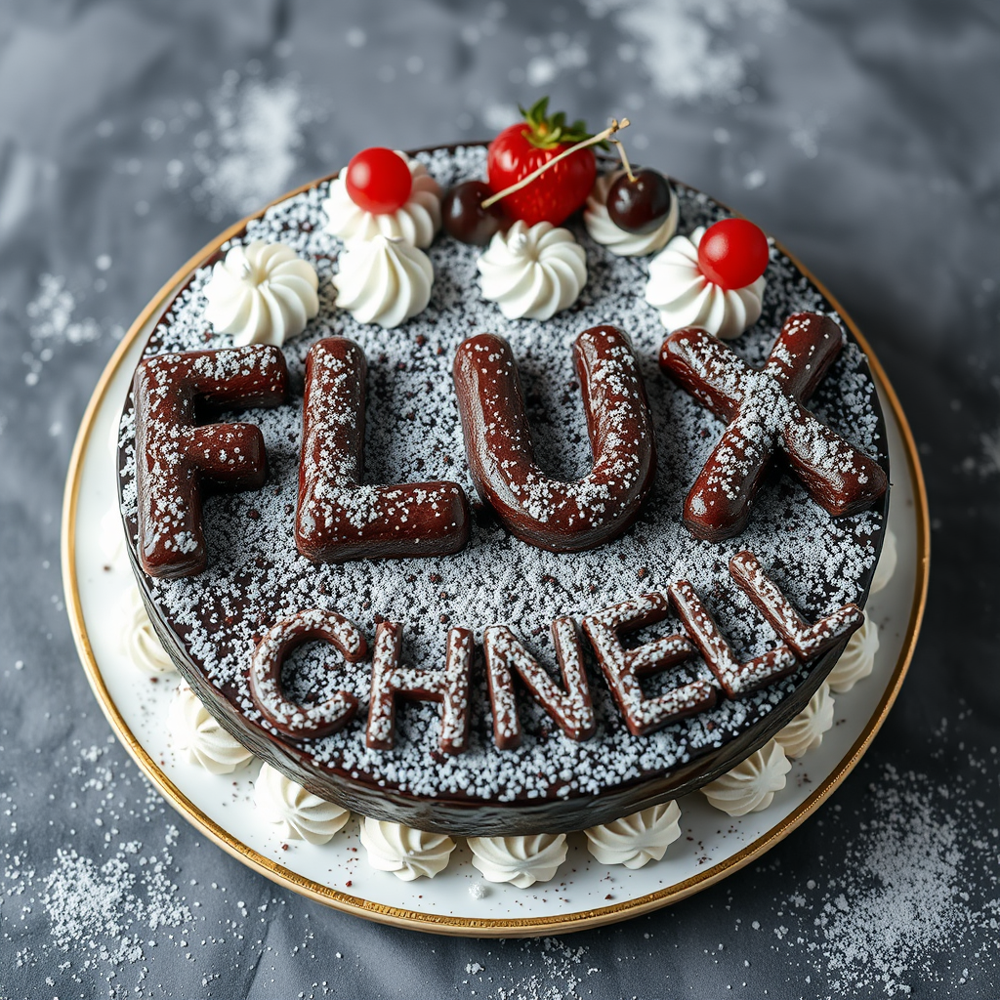
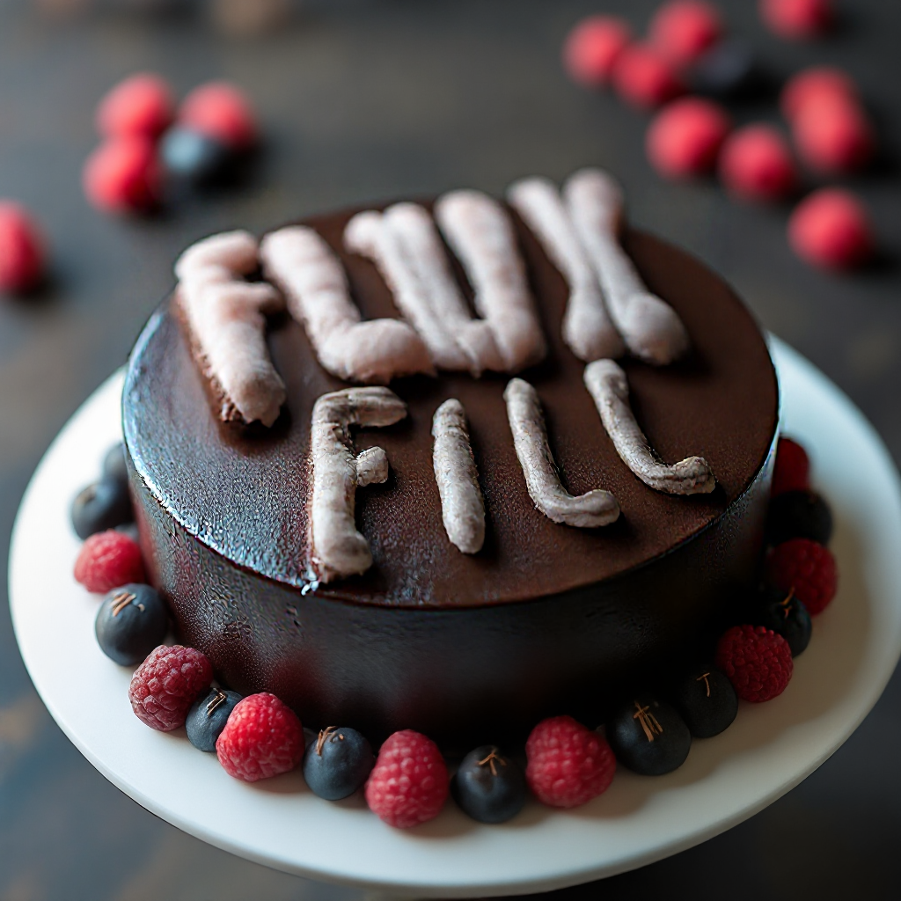

# The Missing Manual: Using Flux Models and Tools in Draw Things

This guide explains how to work with [Flux](https://blackforestlabs.ai) models, tools, and LoRAs in the [Draw Things](https://drawthings.ai) app on macOS. 
It provides instructions, examples, and configurations with the aim of offering sane defaults to 
help new users get started quickly. The guide covers various model types like `Flux.1 [schnell]`, 
`Flux.1 [dev]`, inpainting/outpainting options, and specialized LoRAs for depth and edge-guided generation.

**Note:** This guide is open to contributions. If you want to improve or extend it, feel free to submit a pull request on GitHub. PRs are welcome!

All models used in this guide can be directly downloaded within Draw Things.

### User Interface

Here is a quick overview of the Draw Things User Interface, that helps you
find the inputs and settings described in the upcoming sections:

1. Model Selection
1. LoRA Selection
1. Control Selection
1. Steps
1. Restoring default settings and paste settings in JSON Format
1. Prompt
1. Eraser Tools for Masking
1. Switch between Layers
1. Start a new canvas (Image Layer)
1. Revert to all Layers being empty


## FLUX.1 [schnell] - Text to Image

schnell is the fastest Flux model.

### Settings and Input

Restore default configuration and then apply the following settings

- Model: `Flux.1 [schnell]`
- Steps: `4`

Provide a text prompt.

<details>
<summary>Click to expand configuration</summary>

```json
{
  "batchCount": 1,
  "batchSize": 1,
  "clipSkip": 1,
  "controls": [],
  "guidanceScale": 4.5,
  "height": 1024,
  "hiresFix": false,
  "loras": [],
  "maskBlur": 1.5,
  "maskBlurOutset": 0,
  "model": "flux_1_schnell_q8p.ckpt",
  "preserveOriginalAfterInpaint": true,
  "sampler": 12,
  "seed": 1337,
  "seedMode": 2,
  "separateClipL": false,
  "sharpness": 0,
  "shift": 1,
  "speedUpWithGuidanceEmbed": true,
  "steps": 4,
  "strength": 1,
  "tiledDecoding": false,
  "tiledDiffusion": false,
  "width": 1024,
  "zeroNegativePrompt": false
}
```

</details>

#### Examples

<table>
  <tr>
    <th>Seed</th>
    <td>1337</td>
  </tr>
  <tr>
    <th>Prompt</th>
    <td>black forest gateau cake spelling out the words "FLUX SCHNELL", tasty, food photography, dynamic shot</td>
  </tr>
  <tr>
    <th>Result</th>
    <td></td>
  </tr>
</table>

## FLUX.1 [dev] - Text to Image

Open-weight non-commercial version of Flux

### Settings and Input

Restore default configuration and then apply the following settings

- Model: `Flux.1 [dev]`
- Steps: `28`
- Text Guidance: 3.5

Provide a text prompt.

<details>
<summary>Click to expand configuration</summary>

```json
{
  "batchCount": 1,
  "batchSize": 1,
  "clipSkip": 1,
  "controls": [],
  "guidanceScale": 3.5,
  "height": 1024,
  "hiresFix": false,
  "loras": [],
  "maskBlur": 1.5,
  "maskBlurOutset": 0,
  "model": "flux_1_dev_q8p.ckpt",
  "preserveOriginalAfterInpaint": true,
  "resolutionDependentShift": true,
  "sampler": 12,
  "seed": 1337,
  "seedMode": 2,
  "separateClipL": false,
  "sharpness": 0,
  "shift": 3.1581929,
  "speedUpWithGuidanceEmbed": true,
  "steps": 28,
  "strength": 1,
  "tiledDecoding": false,
  "tiledDiffusion": false,
  "width": 1024,
  "zeroNegativePrompt": false
}
```

</details>

#### Examples

<table>
  <tr>
    <th>Seed</th>
    <td>1337</td>
  </tr>
  <tr>
    <th>Prompt</th>
    <td>black forest gateau cake spelling out the words "FLUX DEV", tasty, food photography, dynamic shot</td>
  </tr>
  <tr>
    <th>Result</th>
    <td></td>
  </tr>
</table>

## Hyper FLUX.1 [dev] 8-Step - Text to Image

LoRA to accelerate generation. This LoRA can be combined with all other [dev] variants of Flux.

### Settings and Input

Restore default configuration and then apply the following settings

- Model: `Flux.1 [dev]`
- LoRA: `Hyper FLUX.1 [dev] 8-Step (Flux.1)`, Weight: 100%
- Steps: `8`
- Text Guidance: 3.5

Provide a text prompt.

<details>
<summary>Click to expand configuration</summary>

```json
{
  "batchCount": 1,
  "batchSize": 1,
  "clipSkip": 1,
  "controls": [],
  "guidanceScale": 3.5,
  "height": 1024,
  "hiresFix": false,
  "loras": [
    {
      "file": "hyper_flux.1__dev__8_step_lora_f16.ckpt",
      "weight": 1
    }
  ],
  "maskBlur": 1.5,
  "maskBlurOutset": 0,
  "model": "flux_1_dev_q8p.ckpt",
  "preserveOriginalAfterInpaint": true,
  "resolutionDependentShift": true,
  "sampler": 12,
  "seed": 1337,
  "seedMode": 2,
  "separateClipL": false,
  "sharpness": 0,
  "shift": 3.1581929,
  "speedUpWithGuidanceEmbed": true,
  "steps": 8,
  "strength": 1,
  "tiledDecoding": false,
  "tiledDiffusion": false,
  "width": 1024,
  "zeroNegativePrompt": false
}
```

</details>

#### Examples

<table>
  <tr>
    <th>Seed</th>
    <td>1337</td>
  </tr>
  <tr>
    <th>Prompt</th>
    <td>black forest gateau cake spelling out the words "Hyper FLUX 8-step", tasty, food photography, dynamic shot</td>
  </tr>
  <tr>
    <th>Result</th>
    <td></td>
  </tr>
</table>

## FLUX.1 Fill [dev] - Inpainting and Outpainting with Text

Base model for inpainting and outpainting

### Settings and Input

Restore default configuration and then apply the following settings

- Model: `Flux.1 Fill [dev]`
- Steps: `28`
- Text Guidance: 3.5
- Mask Blur: `5`
- Mask Blur Outset: `10`
- Preserve Original After Inpaint: `Disable`

Provide a text prompt and a masked input image on the 'Image' layer.

<details>
<summary>Click to expand configuration</summary>

```json
{
  "batchCount": 1,
  "batchSize": 1,
  "clipSkip": 1,
  "controls": [],
  "guidanceScale": 3.5,
  "height": 1024,
  "hiresFix": false,
  "loras": [],
  "maskBlur": 5,
  "maskBlurOutset": 10,
  "model": "flux_1_fill_dev_q8p.ckpt",
  "preserveOriginalAfterInpaint": false,
  "resolutionDependentShift": true,
  "sampler": 12,
  "seed": 1337,
  "seedMode": 2,
  "separateClipL": false,
  "sharpness": 0,
  "shift": 3.1581929,
  "speedUpWithGuidanceEmbed": true,
  "steps": 28,
  "strength": 1,
  "tiledDecoding": false,
  "tiledDiffusion": false,
  "width": 1024,
  "zeroNegativePrompt": false
}
```

</details>

#### Examples

<table>
  <tr>
    <th colspan="2">Example 1: Inpainting with "Flux Fill"</th>
  </tr>
  <tr>
    <th>Seed</th>
    <td>1337</td>
  </tr>
  <tr>
    <th>Image Layer</th>
    <td></td>
  </tr>
  <tr>
    <th>Prompt</th>
    <td>black forest gateau cake spelling out the words "FLUX FILL", tasty, food photography, dynamic shot</td>
  </tr>
  <tr>
    <th>Result</th>
    <td></td>
  </tr>
  <tr>
    <th colspan="2">Example 2: Outpainting with "Flux Fill"</th>
  </tr>
  <tr>
    <th>Seed</th>
    <td>1337</td>
  </tr>
  <tr>
    <th>Image Layer</th>
    <td></td>
  </tr>
  <tr>
    <th>Prompt</th>
    <td>black forest gateau cake spelling out the words "FLUX FILL", tasty, food photography, dynamic shot</td>
  </tr>
  <tr>
    <th>Result</th>
    <td></td>
  </tr>
</table>

## FLUX.1 Canny [dev]

LoRA for edge-guided image generation

### Settings and Input

Restore default configuration and then apply the following settings

- Model: `Flux.1 [dev]`
- Steps: `28`
- LoRA: `Flux.1 Canny [dev]`, Weight: 80%
- Text Guidance: 3.5

Provide a text prompt and a control image on the **'Image' layer**.
**The control image must cover the whole layer.**

<details>
<summary>Click to expand configuration</summary>

```json
{
  "batchCount": 1,
  "batchSize": 1,
  "clipSkip": 1,
  "controls": [],
  "guidanceScale": 3.5,
  "height": 1024,
  "hiresFix": false,
  "loras": [
    {
      "file": "flux_1_canny_dev_lora_f16.ckpt",
      "weight": 0.8
    }
  ],
  "maskBlur": 1.5,
  "maskBlurOutset": 0,
  "model": "flux_1_dev_q8p.ckpt",
  "preserveOriginalAfterInpaint": true,
  "resolutionDependentShift": true,
  "sampler": 12,
  "seed": 1337,
  "seedMode": 2,
  "separateClipL": false,
  "sharpness": 0,
  "shift": 3.1581929,
  "speedUpWithGuidanceEmbed": true,
  "steps": 28,
  "strength": 1,
  "tiledDecoding": false,
  "tiledDiffusion": false,
  "width": 1024,
  "zeroNegativePrompt": false
}
```

</details>

#### Examples

<table>
  <tr>
    <th>Seed</th>
    <td>1337</td>
  </tr>
  <tr>
    <th>Image Layer</th>
    <td>
     
     <br/>
     Important: Image must cover whole layer area
  </td>
  </tr>
  <tr>
    <th>Prompt</th>
    <td>black forest gateau cake spelling out the words "FLUX CANNY", tasty, food photography, dynamic shot</td>
  </tr>
  <tr>
    <th>Result</th>
    <td></td>
  </tr>
</table>

## FLUX.1 Depth [dev]

LoRA for depth-aware image generation

### Settings and Input

Restore default configuration and then apply the following settings

- Model: `Flux.1 [dev]`
- Steps: `28`
- LoRA: `Flux.1 Depth [dev]`, Weight: 100%
- Text Guidance: 3.5

Provide a text prompt and a control image on the **'Depth' layer**.

<details>
<summary>Click to expand configuration</summary>

```json
{
  "batchCount": 1,
  "batchSize": 1,
  "clipSkip": 1,
  "controls": [],
  "guidanceScale": 3.5,
  "height": 1024,
  "hiresFix": false,
  "loras": [
    {
      "file": "flux_1_depth_dev_lora_f16.ckpt",
      "weight": 1
    }
  ],
  "maskBlur": 1.5,
  "maskBlurOutset": 0,
  "model": "flux_1_dev_q8p.ckpt",
  "preserveOriginalAfterInpaint": true,
  "resolutionDependentShift": true,
  "sampler": 12,
  "seed": 1337,
  "seedMode": 2,
  "separateClipL": false,
  "sharpness": 0,
  "shift": 3.1581929,
  "speedUpWithGuidanceEmbed": true,
  "steps": 28,
  "strength": 1,
  "tiledDecoding": false,
  "tiledDiffusion": false,
  "width": 1024,
  "zeroNegativePrompt": false
}

```

</details>

#### Examples

<table>
  <tr>
    <th>Seed</th>
    <td>1337</td>
  </tr>
  <tr>
    <th>Depth Layer</th>
    <td>
     
  </td>
  </tr>
  <tr>
    <th>Prompt</th>
    <td>excessive amount of caster sugar covering a cake spelling out the words "FLUX DEPTH", tasty, food photography, dynamic shot</td>
  </tr>
  <tr>
    <th>Result</th>
    <td></td>
  </tr>
</table>

## FLUX.1 Redux [dev]

Controlnet to generate variations of existing images. Can be combined with both [schnell] and
[dev].

### Settings and Input

Restore default configuration and then apply the following settings

- Model: `Flux.1 [schnell]` or dev
- Steps: `4`or 28 for dev
- Control: `Flux.1 Redux [dev]`

Provide a redux image on the **'Moodboard' layer**.

<details>
<summary>Click to expand configuration for [schnell]</summary>

```json
{
  "batchCount": 1,
  "batchSize": 1,
  "clipSkip": 1,
  "controls": [
    {
      "controlImportance": "balanced",
      "downSamplingRate": 1,
      "file": "flux_1_redux_f16.ckpt",
      "globalAveragePooling": false,
      "guidanceEnd": 1,
      "guidanceStart": 0,
      "inputOverride": "",
      "noPrompt": false,
      "targetBlocks": [],
      "weight": 1
    }
  ],
  "guidanceScale": 3.5,
  "height": 1024,
  "hiresFix": false,
  "loras": [],
  "maskBlur": 5,
  "maskBlurOutset": 10,
  "model": "flux_1_schnell_q8p.ckpt",
  "preserveOriginalAfterInpaint": false,
  "sampler": 12,
  "seed": 1337,
  "seedMode": 2,
  "separateClipL": false,
  "sharpness": 0,
  "shift": 1,
  "speedUpWithGuidanceEmbed": true,
  "steps": 4,
  "strength": 1,
  "tiledDecoding": false,
  "tiledDiffusion": false,
  "width": 1024,
  "zeroNegativePrompt": false
}

```

</details>

<details>
<summary>Click to expand configuration for [dev]</summary>

```json
{
  "batchCount": 1,
  "batchSize": 1,
  "clipSkip": 1,
  "controls": [
    {
      "controlImportance": "balanced",
      "downSamplingRate": 1,
      "file": "flux_1_redux_f16.ckpt",
      "globalAveragePooling": false,
      "guidanceEnd": 1,
      "guidanceStart": 0,
      "inputOverride": "",
      "noPrompt": false,
      "targetBlocks": [],
      "weight": 1
    }
  ],
  "guidanceScale": 3.5,
  "height": 1024,
  "hiresFix": false,
  "loras": [],
  "maskBlur": 5,
  "maskBlurOutset": 10,
  "model": "flux_1_dev_q8p.ckpt",
  "preserveOriginalAfterInpaint": false,
  "resolutionDependentShift": true,
  "sampler": 12,
  "seed": 1337,
  "seedMode": 2,
  "separateClipL": false,
  "sharpness": 0,
  "shift": 3.1581929,
  "speedUpWithGuidanceEmbed": true,
  "steps": 28,
  "strength": 1,
  "tiledDecoding": false,
  "tiledDiffusion": false,
  "width": 1024,
  "zeroNegativePrompt": false
}

```

</details>

#### Examples

<table>
  <tr>
    <th colspan="2">Example 1: Redux with Flux [schnell]</th>
  </tr>
  <tr>
    <th>Seed</th>
    <td>1337</td>
  </tr>
  <tr>
    <th>Moodboard Layer</th>
    <td>
      100%
  </td>
  </tr>
  <tr>
    <th>Result</th>
    <td></td>
  </tr>
</table>
